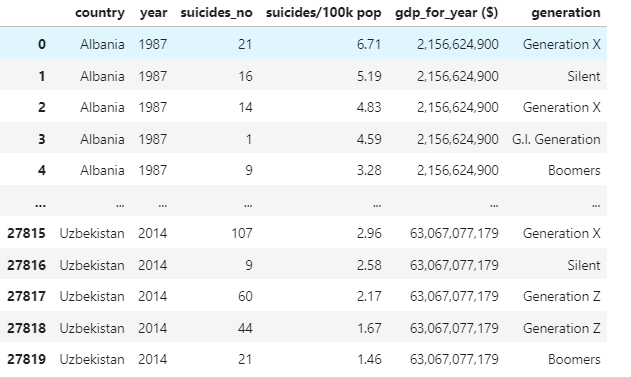

# What's the Happiest Generation?
Analysis of global suicide rates over the past 6 generations. 

## Background and Motivtion
The last 100 years are split into 6 different generations:

Age-Generation Breakdown:

+ Generation Z: 1997-2012
+ Millenials (Generation Y): 1981-1996
+ Generation X: 1965-1980
+ Baby Boomers: 1946-1964
+ Silent Generation: 1928-1945
+ G.I. Generation: 1901-1927

The latest generation is called the Alpha generation and starts from year 2012. 

I would think that the population with the least amount of suicides would be consider the happiest, and I'd like to explore a little further to decide which generation might fall into that category as well. 

## Data

The data set spanned up until 2016 but the suicide rate was relativeley low for that year. I am not sure if this year was an outlier, of if the 2016 memes were true about it being the happiest year.

It could've also simply be because the data set is not complete (but that's less exciting). 

I also used a data set conaining the global populations for the same decade to compare the suicide rate to.

The data consisted of global suicide rates broken down into country and then by generation. After being split up by country and generation the data was also separate by sex. But for the purposes of this project, I will be using the total count male and female individuals 

The columns of the data that I kept included the following: 

## Explotatory Data Analysis

Starting 

After some analysis, I found that a there was a lot of zeroes for the suicide count when it came to the G.I. generation. This could be due to the reduction of the population given the range of years that that they were born in.

I decided to only look at the last 10 years of data. This is the global progression of suicide rates between the years of 2006 and the end of 2015:

I wanted to see whether any significant rise or drop in the rates had occurred in the final 10 years of the data collection and it seems that there was a significant drop from over 12,000 down to a little over 8,000 suicides per 100,000 people in a given population.

I then the average suicide counts per 100,000 people for each country. I then arranged that list in ascending oder but average suicide as follows:

## Statistical Analysis

## Conclusion

First, given that the G.I. Generation was an outlier, I am going to consider the other 5 generations.

## Future Steps

I would like to dig further to find a more complete data set because this one only contained 101 out of the 195 countries in the world. 

There was also a lot of years' worth of data that was missing and I compensated by using the mean of the years that we had. Though, I would like to have found a more accurate way to do so.

There was a column of data that provided the annual GDP for each country and I would also like to create a scatterplot to show whether there is any correlation between GDP and suicide rate.

A comparison between global suicide rates and global death rates would be interesting to see the impact.

## Contact Information

Amy Williams
arw.62596@gmail.com