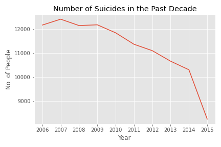
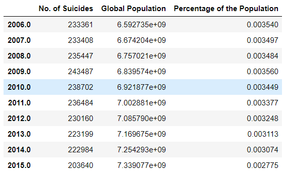
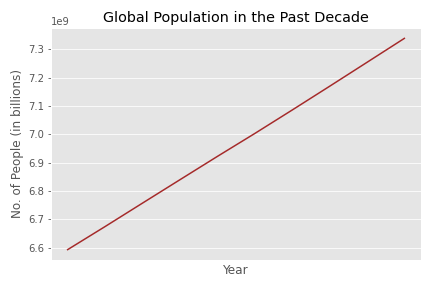

# Happiest-Generation
Analysis of global suicide rates over the past 6 generations. 

## Background and Motivtion

## Data

The data consisted of global suicide rates broken down into country and then by generation. 

Age-Generation Breakdown:
+ Generation Z
+ Millenials (Generation Y)
+ Generation X
+ Silent Generation
+ Baby Boomers
+ G.I. Generation

After being split up by country and generation the data was also separate by sex. 

The columns of the data that I kept

The data set spanned up until 2016 but the suicide rate was relativeley low for that year. I am not sure if this year was an outlier, of if the 2016 memes were true about it being the happiest year.

It could've also simply be because the data set is not complete (but that's less exciting). 

I also used a data set conaining the global populations for the same decade to compare the suicide rate to.

## Explotatory Data Analysis

## Statistical Analysis

## Conclusion

## Contact Information